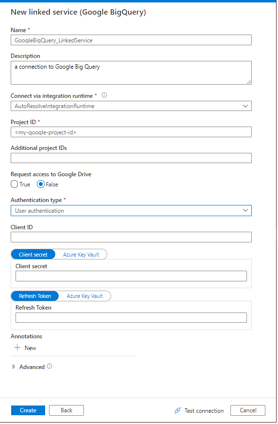
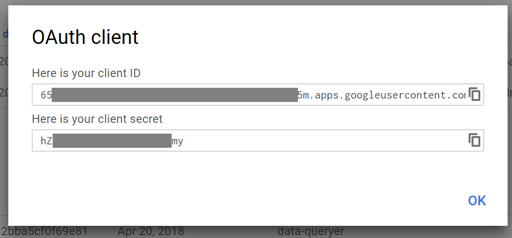

# Connecting to Google BigQuery with Azure Data Factory v2
The new version of Azure Data Factory includes a
[built-in connector to Google BigQuery](https://docs.microsoft.com/en-us/azure/data-factory/connector-google-bigquery).
However, the documentation is a bit sparse on how to authenticate between the two services.  This guide will provide some "lessons
learned" for configuring the connector.

## Authentication Types

When configuring a new linked service for Google BigQuery, you must select the "Authentication type".  There are two choices:
User Authentication and Service Authentication.

**Service Authentication** allows you to provide a .p12 key file containing the credentials from Google.  However, this option is
only available when using the Self-Hosted Integration Runtime, which runs on an on-premises server.  If you want a cloud-to-cloud
only solution, you cannot use Service Authentication.

**User Authentication** uses OAuth 2 authorization to connect your Google user account to Azure Data Factory.  This option can be
used with a default Azure integration runtime for a cloud-only solution.  The remainder of this guide deals with this type of
authentication.

## Configuring "User Authentication"
When you configure user authentication for Azure Data Factory to work with Google BigQuery, the "New Linked Service" UI requires
that you provide three values when using "User Authentication".  These values are:
Client Id, Client Secret, and Refresh Token.  The first two values can be easily obtained from the GCP console.  The following
section shows how to get these two values.  Obtaining the "Refresh Token" is covered later in this guide.

### Creating New Client Id and Client Secret in GCP
You must use the [Google API Console](https://console.developers.google.com/) to obtain OAuth 2.0 credentials such as a
client ID and client secret that are known to both Google and Azure Data Factory.  Google publishes a document named
"[Using OAuth 2.0 for Web Server Applications](https://developers.google.com/identity/protocols/OAuth2WebServer)" that gives all
of the details for this process.  However, to make it easier, I will distill the steps here.

1. If you have not yet enabled Google APIs for your project, you must do that first. ([details](https://developers.google.com/identity/protocols/OAuth2WebServer#prerequisites))
2. In the Google Cloud Platform console, select your project.  Then select "Credentials" from the toolbar on the left side of the screen.
3. Click the "Create credentials" drop-down and select "OAuth client ID".
4. For "Application type", select "Web application".
   - Give the client a name that will allow you to identify it later.
   - The "Authorized JavaScript origins" field can be left blank.
   - For "Authorized redirect URIs", you must provide a URL (even if it's a fake URL).  Be sure to make note of the *exact* value that you use (including whether or not you used a trailing slash) because you will use it later.  I recommend you use:  `http://127.0.0.1/`
 5. Click the "Create" button.
 

 
The GCP Console will display the new client ID and client secret.  You can copy these values and paste them into the corresponding
fields in ADF's "New Linked Service" form.

### Obtaining a Refresh Token
The tricky part of this process is obtaining a refresh token.  To get the token, you must call the Google authentication service
REST API to get an access code.  Then you have to pass that access code back to Google to get a refresh token.

To make this process easier, I have written <a href="Google API Auth.ps1">a PowerShell script</a> (which is available in this
GitHub repo) you can use to do the "OAuth dance" with Google and get a refresh token that you can provide to Azure Data Factory.
At the top of the script, just provide values for the `clientId`, `clientSecret`, and `redirectUrl` variables.  We got all three
of the values in the previous section of this guide.

Once you've changed the values, you can run the script in a PowerShell window.  It will open a window showing a Google web page
asking for your Google credentials.  Log in to Google as you normally would.  In the same window, Google will then ask you to
authorize the request for access to the OAuth client you created in the previous section.  Click the "Allow" button.

The PowerShell script will then show you the three values you need to configure the linked service in Azure Data Factory, including
the refresh token.  Remember that the client secret and refresh token are keys that grant access to your Google BigQuery data.
Store them securely as you would any password.

